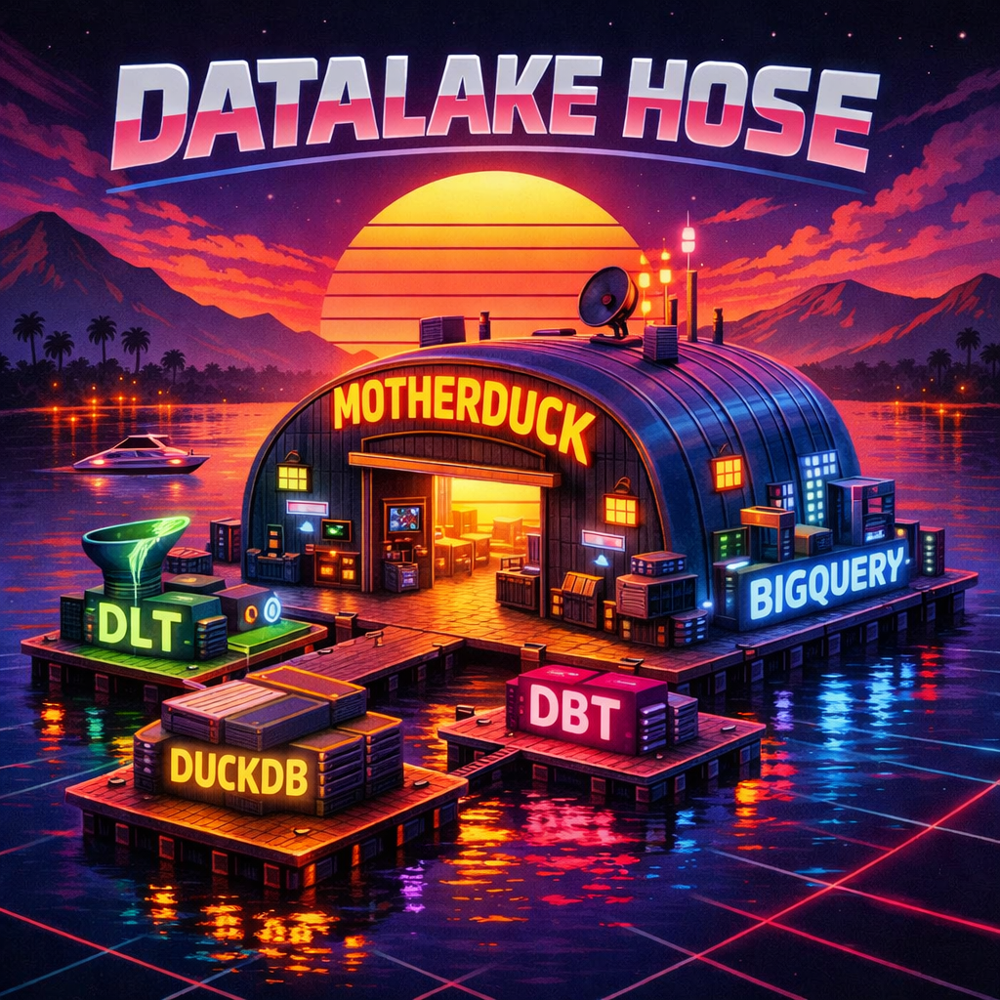

# dwh-on-a-lake

A complete, fast, and simple data warehouse solution built with open-source tools. Get from raw data to production-ready analytics in minutes—with ingestion and transformation included out of the box.

<p align="center">
  
</p>

## Why This Exists

Data warehousing doesn't have to be slow, complex, or expensive. This project proves you can build a production-ready data stack that's:
- **Fast to set up**: Get running in minutes, not months
- **Simple to operate**: Everything is code—no vendor lock-in, no black boxes
- **Feature-rich**: Ingestion and transformation ready to go
- **Cost-effective**: Open-source tools that scale from laptop to cloud

## 🏗️ Complete Data Stack

- **dlt** for ingestion (NewsAPI example) → GCS (Parquet files)
- **dbt Core** for transformations → DuckDB, MotherDuck, or BigQuery
- **Lakehouse pattern**: Raw data in GCS, query with any engine

## 📊 Data Flow

```
┌─────────────┐
│  NewsAPI    │
│   (Source)  │
└──────┬──────┘
       │
       ▼
┌─────────────┐
│     dlt     │
│  (Ingest)   │
└──────┬──────┘
       │
       ▼
┌────────────────────────────────────┐
│         GCS (Data Lake)            │
│   gs://dwh-on-a-lake-prod/dlt/     │
│        *.parquet files             │
└────────┬───────────────────────────┘
         │
         │  External Table Access
         ▼
┌────────────────────────────────────┐
│      Transformation Targets        │
│  ┌──────────┐ ┌──────────────────┐ │
│  │  DuckDB  │ │    MotherDuck    │ │
│  │  (dev)   │ │    (cloud)       │ │
│  └──────────┘ └──────────────────┘ │
│  ┌──────────────────────────────┐  │
│  │         BigQuery             │  │
│  │         (cloud)              │  │
│  └──────────────────────────────┘  │
└────────┬───────────────────────────┘
         │ dbt
         ▼
┌─────────────────────────────────────┐
│  Staging → Intermediate → Mart      │
│  (dedup)    (enrich)     (aggregate)│
└─────────────────────────────────────┘
```

## ✨ Key Features

- **Fast ingestion** with dlt: Connect to APIs, databases, and files in minutes
- **Powerful transformations** with dbt: Build reliable, tested data models
- **Multi-target support**: Same dbt code runs on DuckDB, MotherDuck, and BigQuery
- **Lakehouse architecture**: GCS stores raw Parquet, compute engines query directly
- **Zero vendor lock-in**: Everything is open source and portable

## 🚀 Getting Started

Get up and running in minutes. See `GETTING_STARTED.md` for:
- Quick installation steps
- Dev/prod setup with DuckDB
- Running the full pipeline: ingestion → transformation
- Example configurations and snippets

## 📁 Project Structure

```
dwh-on-a-lake/
├── ingestion/                    # dlt pipelines
│   └── newsapi_pipeline.py      # NewsAPI ingestion
│
└── transformation/               # dbt project
    ├── models/                   # dbt models
    │   ├── staging/             # Raw data staging
    │   ├── intermediate/        # Intermediate transformations
    │   └── mart/                # Analytics-ready marts
    ├── macros/                   # dbt macros
    │   ├── gcs_credentials.sql  # GCS auth for DuckDB/MotherDuck
    │   └── external_tables/     # BigQuery external table setup
    ├── profiles.yml             # Target configurations
    ├── run_motherduck.sh        # MotherDuck deployment script
    └── run_bigquery.sh          # BigQuery deployment script
```

## 🔗 Quick links

- Getting started: `GETTING_STARTED.md`
- dbt project: `transformation/`

## 📚 Learn More

- [dlt Documentation](https://dlthub.com/docs)
- [dbt Documentation](https://docs.getdbt.com)
- [DuckDB Documentation](https://duckdb.org/docs/)

## 📄 License

[Add your license here]

## 🤝 Contributing

[Add contribution guidelines here]

